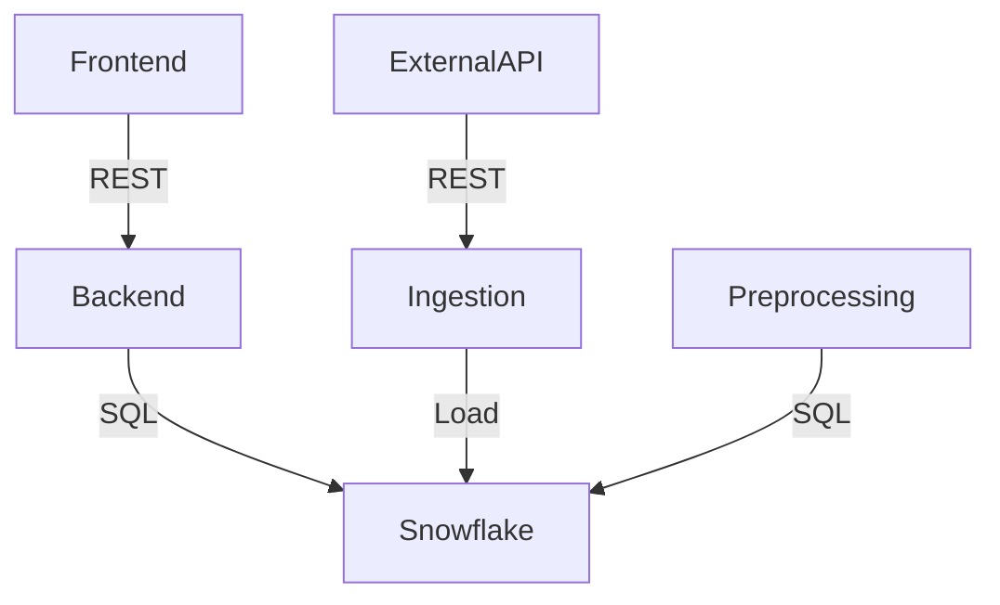

# sentiment-tracker
*Real-time sentiment analytics dashboard powered by a Python backend and a Next.js frontend, sourcing data from a Snowflake data layer.*

       

1) Title + Badge Bar
2) Overview
3) System Architecture
4) Tech Stack
5) Quick Start
6) Key Features

2) Overview
sentiment-tracker is a full-stack sentiment analytics dashboard that ingests, preprocesses, and visualizes sentiment data from a Snowflake data layer. It uses a Python-based backend to run an ETL pipeline (Snowflake ingestion and preprocessing) and a Next.js/React frontend for KPI cards, mood meters, trend charts, and a tweet explorer. Data flows from an ingestion layer into Snowflake and is exposed to the frontend via a RESTful API.

3) System Architecture


4) Tech Stack
| Category | Technologies |
|----------|-------------|
| Backend  |    |
| Frontend |     |
| Database |  |

5) Quick Start
Prerequisites: Node.js 18+ and Python 3.11+.

```bash
# Clone the repository
git clone https://github.com/di5ha/sentiment-tracker.git
cd sentiment-tracker

# Backend setup
python3 -m venv .venv
source .venv/bin/activate
pip install -r backend/requirements.txt

# Frontend setup
cd frontend
npm ci

# Run (in separate terminals)
# Backend (ASGI)
uvicorn backend.main:app --reload
# Or if your backend is run directly
# python backend/main.py
```

6) Key Features
- ETL data pipeline: Snowflake ingestion and preprocessing to prepare analytics-ready sentiment data.
- Real-time KPI cards and mood meter: React components powered by a Tailwind-styled UI for fast, on-brand dashboards.
- Trend and distribution visualizations: Time-series sentiment trends and score distribution for in-depth insight.
- Tweet Explorer: Client-side filters and server-backed search to inspect individual tweets and their sentiments.
- Clean architecture with REST API: Clear separation of frontend and backend, enabling scalable deployment and DX-focused development.